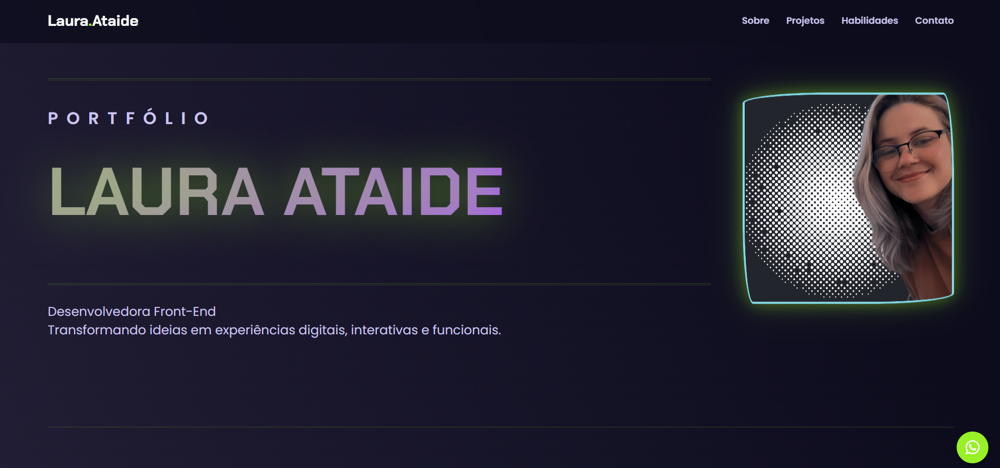

# 🌟 Landing Page 🌟
## Portfólio de Projetos | Laura Ataide 👾


Uma landing page pessoal e responsiva, criada para ser meu portfólio central, apresentando os projetos que desenvolvi e minhas habilidades como Desenvolvedora Full Stack em Formação.

---

### 👁️‍🗨️ Visão Geral

Este projeto é a minha página de apresentação profissional. O objetivo é ter um espaço centralizado para demonstrar minhas competências, listar as tecnologias com as quais trabalho e, principalmente, exibir os projetos em que trabalhei, tanto os concluídos quanto os que estão em andamento. Uma vitrine digital para o meu trabalho!

---

### 🚧 Status do Projeto

> ✨ **Projeto em elaboração e aperfeiçoamento contínuo.** ✨
>
> Esta landing page está em desenvolvimento ativo. Novas funcionalidades, projetos e melhorias visuais serão adicionados aos poucos, conforme avanço nos meus estudos e na construção de novas aplicações. Acompanhe a evolução!

---

### 🚀 Demonstração (Ao Vivo)

Você pode acessar a versão mais atual da landing page através do link abaixo:

**[➡️ Acessar a Landing Page](https://lauraataide8.github.io/landing.page/)**

---

### 🖼️ Preview




---

### 💡 Funcionalidades

-   [x] Design Responsivo (se adapta a celulares e desktops)
-   [x] Seção "Sobre Mim" com link para o perfil principal do GitHub
-   [x] Lista de Habilidades e Tecnologias
-   [ ] Galeria de Projetos com links e descrições detalhadas
-   [ ] Formulário de Contato funcional
-   [x] Integração com redes sociais

---

### 📜 Licença

Este projeto está sob a licença MIT. Veja o arquivo LICENSE para mais detalhes.

---
### 💻 Tecnologias Utilizadas

As seguintes ferramentas e tecnologias foram utilizadas na construção do projeto:


---

### Contato

  <a href="https://www.linkedin.com/in/lauraataide91/" target="_blank"></a>
  <a href="mailto:lauramartinsataide@gmail.com"></a>
 

### ⚙️ Como Rodar o Projeto

Este é um projeto estático, então você pode rodá-lo localmente com facilidade.

```bash
# 1. Clone este repositório
git clone [https://github.com/lauraataide8/landing.page.git](https://github.com/lauraataide8/landing.page.git)

# 2. Navegue até a pasta do projeto
cd landing.page

# 3. Abra o arquivo 'index.html' no seu navegador de preferência
#    Você pode fazer isso clicando duas vezes no arquivo ou usando o comando:
#    open index.html (no macOS) ou start index.html (no Windows)
