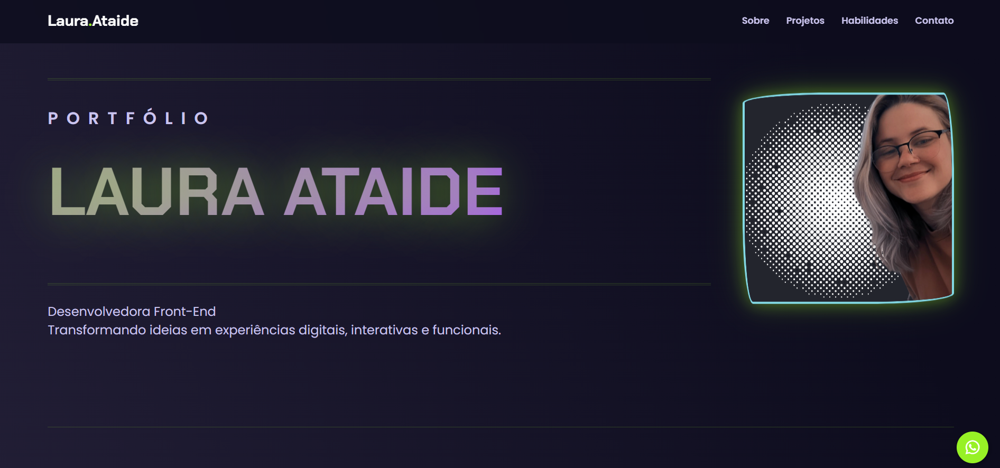

# 🚀 Portfólio Pessoal | Laura Ataide 👾


[](https://github.com/lauraataide8/lauraataide8.github.io/blob/main/LICENSE)

Um portfólio pessoal e responsivo, criado para ser meu hub digital central, apresentando os projetos que desenvolvi e minhas habilidades como Desenvolvedora Full Stack em Formação.

---

### 🌐 Acessar o Projeto (Ao Vivo)

Você pode acessar a versão mais atual do portfólio através do link abaixo:

**[➡️ lauraataide8.github.io](https://lauraataide8.github.io)**

---

### 👁️‍🗨️ Visão Geral

Este projeto é a minha página de apresentação profissional. O objetivo é ter um espaço centralizado para demonstrar minhas competências, listar as tecnologias com as quais trabalho e, principalmente, exibir os projetos em que trabalhei. Funciona como uma vitrine digital para o meu trabalho e minha jornada de aprendizado.

---

### 🖼️ Preview


*(Nota: Certifique-se de que uma imagem chamada `preview.png` existe na pasta `assets` para que esta imagem apareça.)*

---

### 💻 Tecnologias Utilizadas

As seguintes ferramentas e tecnologias foram utilizadas na construção do projeto:


---

### ✨ Funcionalidades

- [x] Design Totalmente Responsivo (Mobile & Desktop)
- [x] Seção "Sobre Mim" detalhada
- [x] Seção de Habilidades e Tecnologias
- [x] Galeria de Projetos interativa com links externos
- [x] Links diretos para Contato e Redes Sociais
- [ ] Formulário de Contato funcional *(futura implementação)*

---

### ⚙️ Como Rodar o Projeto Localmente

Este é um projeto estático, então você pode rodá-lo localmente com facilidade.

```bash
# 1. Clone este repositório
git clone [https://github.com/lauraataide8/lauraataide8.github.io.git](https://github.com/lauraataide8/lauraataide8.github.io.git)

# 2. Navegue até a pasta do projeto
cd lauraataide8.github.io

# 3. Abra o arquivo 'index.html' no seu navegador de preferência
#    (Pode ser feito clicando duas vezes no arquivo)
````

### 📜 Licença
<p align="left">Este projeto está sob a licença MIT. Clique no "badge" no topo da página para ver o arquivo LICENSE para mais detalhes.</P>

### 💬 Contato
<p align="left">
  <a href="https://www.linkedin.com/in/lauraataide91/" target="_blank"></a>
<a href="mailto:lauramartinsataide@gmail.com"></a> </p>
